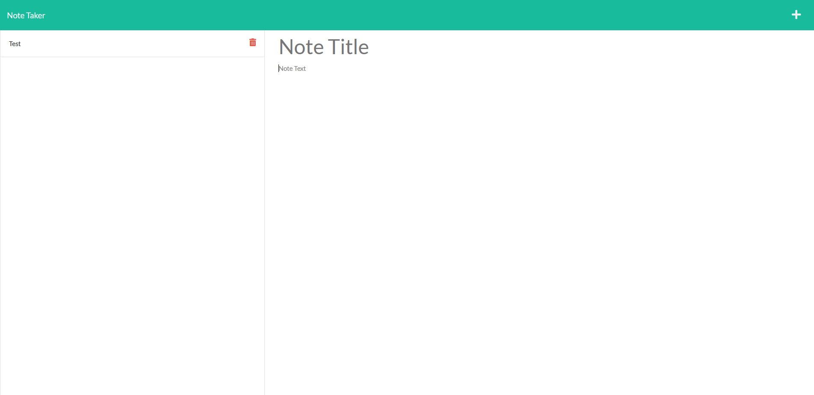
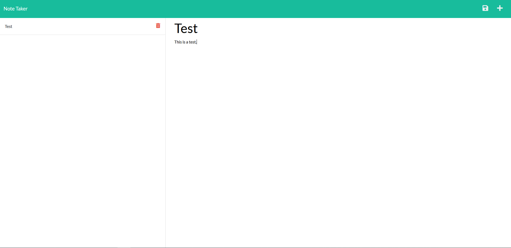

# diginote: A Note-Taking App

## Description

This is an application that allows a user to create, edit, and remove notes. It has a back-end server where all of their notes are stored in a database. This ensures that the notes are kept unless the user explicitly requests that they be erased. 

> Github Repository Link: [https://github.com/nevan-dsouza/diginote](https://github.com/nevan-dsouza/diginote)
>
> Deployed Link: [https://digi-note.herokuapp.com/](https://digi-note.herokuapp.com/)

## Table of Contents

1. [Installation](#installation)
2. [Usage](#usage)
3. [Example](#example)
3. [License](#license)
4. [Tests](#tests)
5. [Questions](#questions)

## Installation

Type "npm install" in the console to install the dependancies this application requires (Express and Path). Alternatively, just use the app in the Heroku link.

## Usage

In order to run this program on your local machine, the user must type "node server.js" in their console for the server to deploy at http//localhost:3001/. 

## Example

### Screenshots of the Application

## License

This project is not under any license.

## Questions

My GitHub Page: [nevan-dsouza](https://github.com/nevan-dsouza)